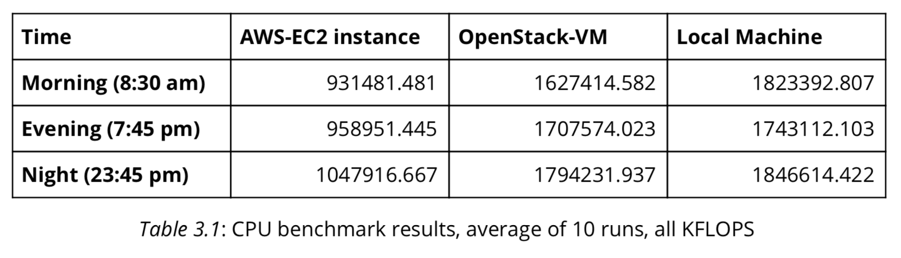
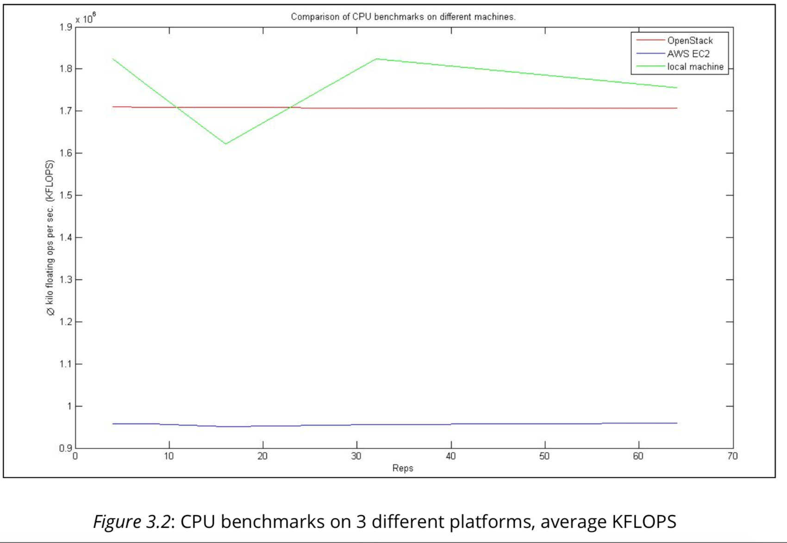

# CPU benchmark  

> **Look at  linpack.sh  and  linpack.c  and shortly describe how the benchmark works.**

    The bash-script,  linpack.sh , first checks if the executable file of this program (benchmark) has already been created. If not,  gcc will be executed. Then the benchmark will check if the operating system is based on Microsoft Windows or Linux/Mac and starts the test automatically. 

The stream editor is used to search for horizontal spacing (blanks or tabs) and replace them with only one blank, globally (” s/[[:blank:]]\+/ /g ”). Afterwards cut is used to extract only one result and display it on the console.

The source file helps to understand the benchmark: First the necessary libs (e. g. math environment) will be imported. Then  main() is executed which will allocate buffer, run the benchmark be calling  linpack()  and free the allocated buffer afterwards.

The benchmark calculates floating point operation, which means it runs simple matrix calculations,  b = A · x . Therefore different procedures are executed, e. g.  matgen() and dgefa()  which initiates a matrix and factors it by gaussian elimination.
The array is of size  n × n , n = 1000 .

> **Find out what the LINPACK benchmark measures. Would you expect
paravirtualization to affect the benchmark? Why?**

The benchmark measures the duration the CPU needs to solve the matrix calculations. The result is provided as FLOPS (FLoating point Operations Per Second), where the amount of operations is devided by the time needed. As stated above, the matrix or the linear equation system is of size 1000 × 1000.

Due to the fact that LINPACK benchmark is executed on a CPU, we do expect influences on OS-assisted virtualization (paravirtualization). Although the guest OS is aware of running in a VM, it still can not make sure to get all resources of the host. Therefore the hypervisor might not allow to use the whole CPU. This will lead to a lower amount of ”(floating point) operations per second” (FL)OPS.

> **Look at the LINPACK measurements. Are they consistent with your expectations? If not, name reasons.**

When comparing the results of the benchmarks between the local machine and the EC2-instance, the expectations mentioned above (OS-assisted virt. will restrict the access to the hardware) consist with the measurements.

The following table 3.1 shows the results of the  linpack -CPU benchmarks for the three platforms. Each entry represents the average value after 5 runs. Multiple runs of the benchmark can reduce the impact of measurement errors or peaks due to unusual conditions. Therefore the benchmarks had also been executed to different times of the day, as web services might allocate different machines due to traffic load and amount of requests. On the other hand, the CPU benchmark for a local machine should lead to similar results, no matter of the time of day, if the conditions were not changed, e.g. no ongoing task except the benchmark vs. rendering a movie.

As seen in the table, the benchmarks on OpenStack-VM and the local machine lead to similar results throughout the whole day. The CPU on the EC2-instance (AWS) is less used in the night and lead therefore the best results during that time. In the morning the CPU where our instance was hosted had been used by a higher amount of processes and led therefore to the lowest results.

The figure 3.2 illustrates the different between the self-hosted (within the same network) OpenStack or local machine CPU benchmarks and the EC2- instance hosted in Frankfurt/Main. It also shows that the benchmark for the local machine is mainly higher than the OpenStack one.
The benchmarks were executed by entering  ./linpack  in the console after compilation with gcc or by simply executing the bash-script  linpack.sh.

For the local machine, the benchmark had been run on an Intel Core i7-3630QM 2.4 GHz with 4 GB DDR3 memory.

