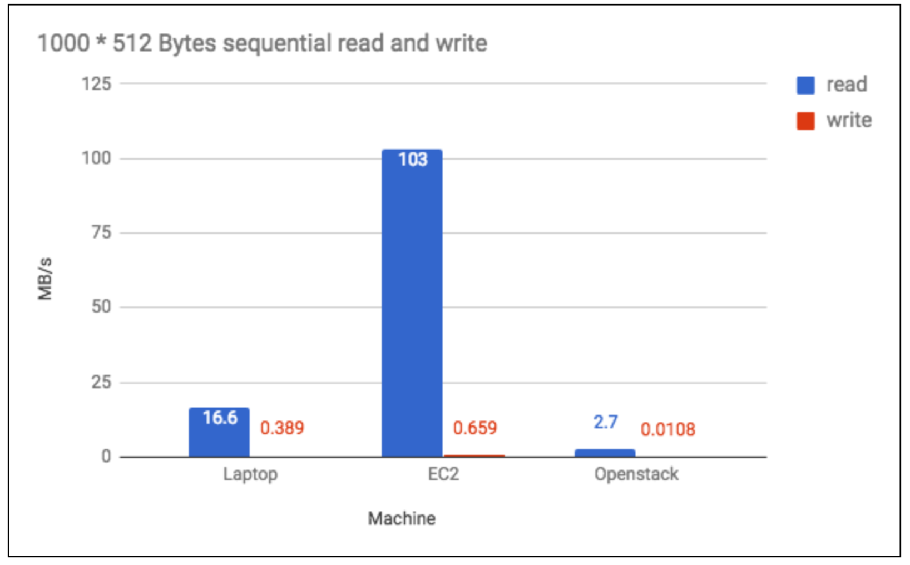
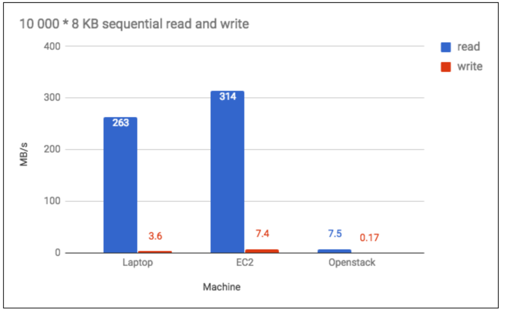
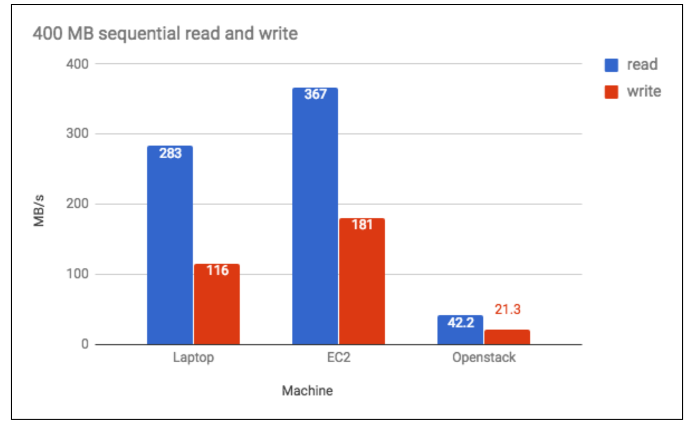
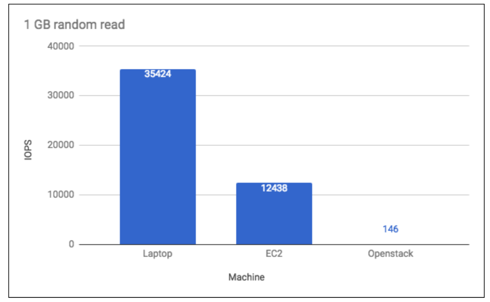
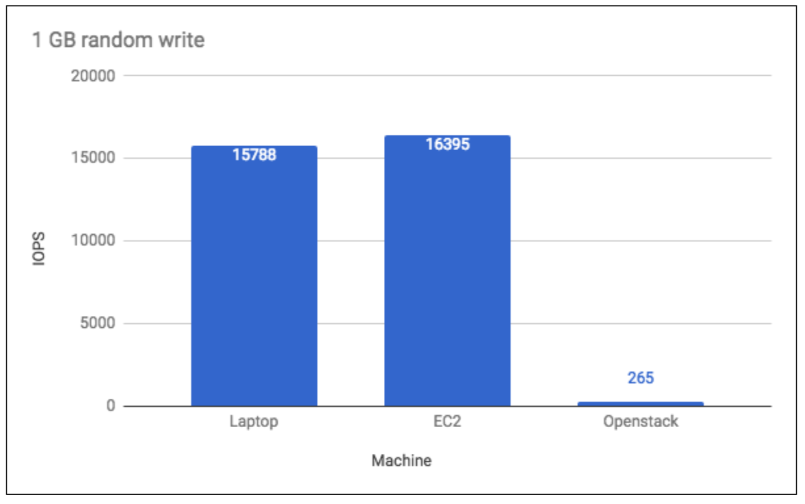
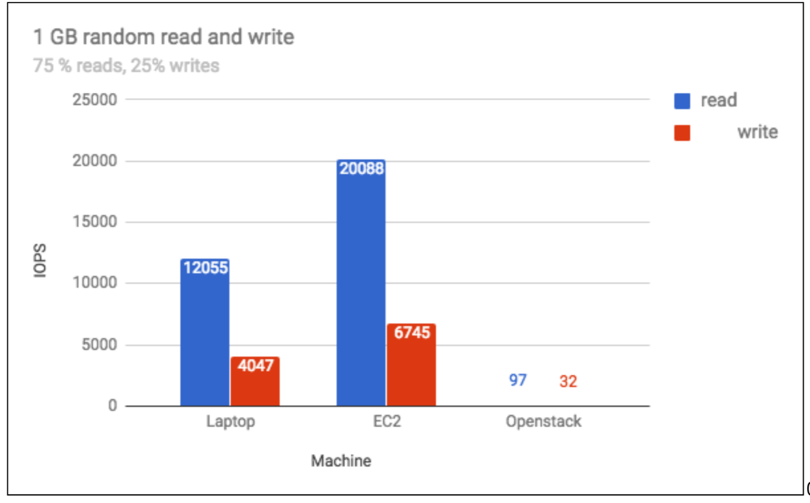
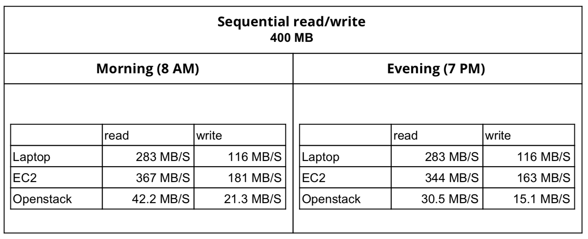
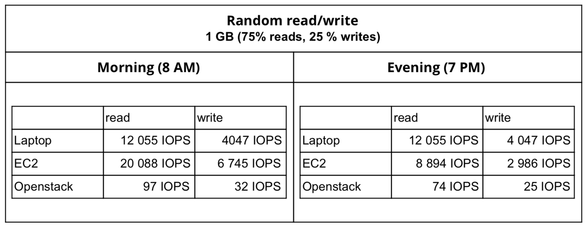

# **Disk benchmark**

> Q1: Look at the disk measurements. Are they consistent with your expectation? If not, name reasons.

> Q2: Based on the comparison with the measurements on your local hard drive, what kind of storage solutions do you think the two clouds use?

 
 **Approach**  
    In this step we will benchmark sequential (Bytes/s) and random (Operations/s) read and write access to the virtualized disk. In the disk benchmarking part we consider the following config for the local machine benchmark :

```
Model : Lenovo Thinkpad X230
Processor : Intel® Core i5-3320M Dual Core (2.60-3.3GHz)
Ram : 4GB DDR3
HDD : SanDisk SSD PLUS 120GB Sata III
```

> **Sequential read/writes**

To perform the benchmarks we used the  dd  command, an utility that can be used to measure both reads and writes. We have set the parameter  of lag  to  dsync  in order to avoid caching which can lead to inaccurate results.
Then during the design of the benchmark we decided to have two different approaches :

- Using a small block size with a large count : in order to evaluate the latency of the hard disk
- Using a large block size with a small count: in order to evaluate the throughput of the hard disk

**To test WRITE speed of hard disk using the DD command:**

```
$ dd if=/dev/zero of=tempfile bs=1M count=1024 oflag=dsync
1024+0 records in
1024+0 records out
1073741824 bytes (1.1 GB) copied, 10.8496 s, 99.0 MB/s
```
The command above writes a bunch of zeros to a file called tempfile, with a size of 1024MB. If we want to use a larger test file, we can change 1024 to a higher number.For instance, changing 1024 to 10000 would write a 10GB temp file. This command only tests the write speed. As we can see, the reported write speed in the example was 99MB/s.

**To test READ speed of a hard disk using the dd command:**
```
$ sudo /sbin/sysctl -w vm.drop_caches=3
vm.drop_caches = 3
$  dd if=tempfile of=/dev/null bs=1M count=1024
1024+0 records in
1024+0 records out
1073741824 bytes (1.1 GB) copied, 9.27495 s, 116 MB/s
```
The first command clears the Linux Cache so we can get the actual read speed of the hard drives. The second command uses DD to read a bunch of null data, specifically 1024MB of null data.
Like before, we can adjust 1024 to a higher number to increase the size of the tempfile. As we can see, the results on my test VM was 116MB/s.
Due to the limited RAM amount on the OpenStack VM (512 MB) we had a limited maximum block size, which we decided to set to 400 MB.

The dd command has a number of problems:

- Single-threaded, sequential-write test. While in a typical web + database serve, the rate is meaningless because typical services do not do long-running sequential writes.
- The amount of data written is small (can not be larger than the server’s RAM), and hence can be strongly influenced by caching on the host server.
- It executes for a very short period of time; just a few seconds on faster I/O subsystems. This isn't enough to get a consistent result.

Below the benchmark results that we ran during the morning, at  8 AM  :





The sequential read speeds are sparse, as we can see the read/write rates on the OpenStack VM are very low compared to the rates in AWS and the local machine, the EC2 rates are almost twice as much as the laptop one (which still uses an SSD).

> **Random read/writes**

Web Servers and Database servers usually deal with random reads and writes, which makes sense to test the random IO performance of the disk, we used 4 KB block.

```
For this part we have three scenarios :

1. Random read of a large file of 1GB with a block size of 4KB
2. Random write of a large file of 1 GB with a block size of 4 KB
3. Random read and write of a large file of 1 GB with a block size of 4 KB, with 25% writes and 75% reads (typical scenario of a database)
```





The random read/write benchmarks also confirm that the OpenStack VM is laying far behind the EC2 VM and the Laptop, this is possibly due the fact that it uses an HDD and also the amount of RAM (512 MB) and CPU (only one vCPU).

We also noticed a degradation of performance during the evening when running the benchmarks at 6 PM, compared to the morning results (8 AM).




    For the sequential read rate, we notice a decrease from 367 MB/s to 344 MB/s for the EC2 instance, which means a decrease of 6% from the morning rates. The write rate decreases by 11% from the morning rates.

    Concerning the OpenStack instance we see a decrease of almost 40% of the sequential read rate (from 42.2 MB/s to 30.5 MB/s). As well as for the write rates where we notice a decrease of 41 % (from 21.3 MB/s to 15.1 MB/s).

    Regarding the random read/write rates in EC2, we see a decrease of 125 % compared to the morning rates. And also a decrease of 30 % for the OpenStack VM.

Looking to the similarities between the rates of the laptop and the EC2 VM we can decide that the EC2 VM has an SSD, and thus the OpenSTack VM has an HDD. Unlike mechanical hard drives, SSDs has no mechanical part and it can both access and write data.

    Reference:
    [1] "Benchmarking."  Benchmarking Linux with Sysbench, FIO, Ioping, and UnixBench: Lots of Examples . Web. 18 June 2017.

    [2] "Learn Linux DD Command - 15 Examples With All Options."  LinOxide . 18 May 2017. Web. 18 June 2017.
    
    [3] "Simple Method to Benchmark Disk Read & Write Speeds From the Linux Command Line." Serenity-Networks . 17 Feb. 2016. Web. 18 June 2017.
