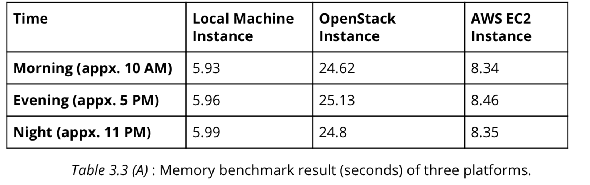
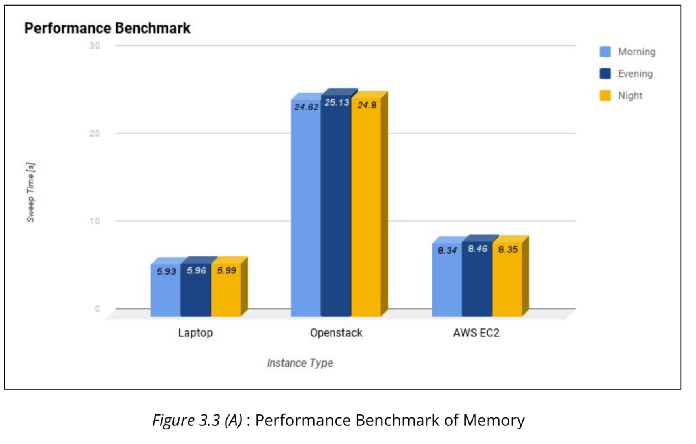

# Memory Benchmark

In memory benchmark , we considered a laptop of the following configuration along with Amazon AWS EC2 and OpenStack instance :

```
Model : Dell Inspiron 1564
Processor: Intel® CoreTM i3 CPU M 330 @ 2.13GHz × 4 RAM : 8GBDDR3
OS : Ubuntu 16.04
```

A shell script and the C code file were provided to determine the memory benchmark. We installed  gcc compiler before executing bash script in three platform and run the bash script as well. we used the following commands:

> Installation of gcc

 To install gcc in OpenStack / local instance :
 ```
    $sudo apt-get update
    $sudo apt-get install gcc
```
> To install gcc in AWS EC2 instance :
```
    sudo yum install gcc
```
> To execute bash script (any possible way): 
```
    $ sh memsweep.sh 
```
> Sample output of the bash script (first time) :
```
    Compiling memsweep.c (requires GNU compiler collection)
    Running memsweep benchmark
    Memsweep time in seconds: 5.954
``` 
### **Benchmark Result**
We ran the script in three different platform. We executed the script in different times of a day (morning,evening,night) and also executed five times to get average value on each execution time of day to avoid measurement error. 

The following table shows the average time data on each platform on three different times of day.



We found difference in result time of the script in three different platform and plotted the
following graph on the above result.



> Find out how the memsweep benchmark works by looking at the shell script and the C code. Would you expect virtualization to affect the memsweep benchmark? Why?

The bash-script,  <span>memsweep.sh</span> , checks to find whether the executable file is created or not. Compiler  gcc will start compiling the program if executable is not found. Later the program checks the operating system (Microsoft Windows or Other ) and start the test.

The C code helps to understand the benchmark. The program allocates block of memory by using  malloc()  library function and use this memory to store values and later free the allocated memory.
This benchmark calculation counts the time (second) by assigning array values and this can be used to determine the access time of the block of memory.

Due to paravirtualized instances it has chance not to use the full hardware resources , as a consequence virtualization will affect in determining benchmark.

>Look at your memsweep measurements. Are they consistent with your expectations. If not, what could be the reason?

The result time of the Openstack platform is higher than other two platforms. As benchmark is performed on paravirtualized EC2 instance, chances to get higher result time in EC2 instance than local machine is high. But the result time (memsweep time) for the self-hosted (within the same network) Openstack instance is high due to the availability of lower memory (512MB) in instances.

